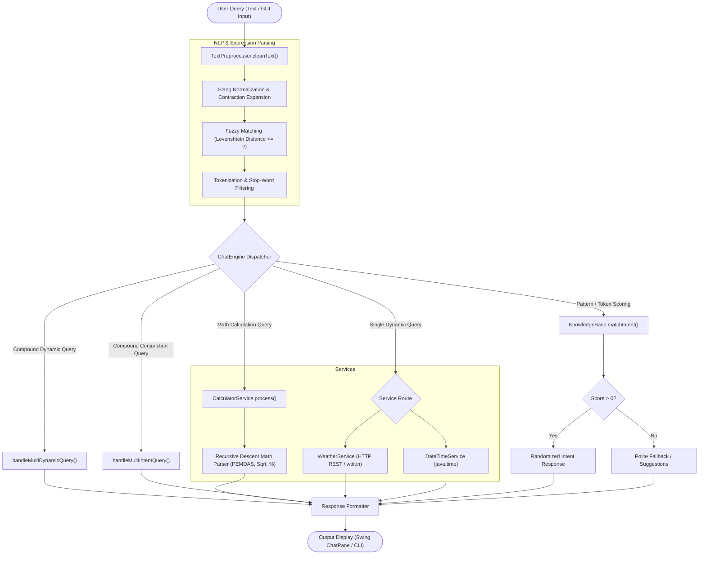

# 🤖 AI Chatbot Assistant

[](https://www.oracle.com/java/)
[](#-automated-testing)
[](#-interfaces)
[](#-technology-stack)
[](LICENSE)
[](CONTRIBUTING.md)

An intelligent, rule-based **AI Virtual Assistant** built in Java featuring natural language text preprocessing, Levenshtein distance typo tolerance, chat slang normalization, compound query resolution, built-in mathematical calculation engine, real-time live weather integration, and dynamic date/time tracking. 

The application offers both a sleek, responsive **Swing Desktop GUI** with chat-bubble rendering and a streamlined **Interactive Command-Line Interface (CLI)**.

---

## 📑 Table of Contents

- [Key Features](#-key-features)
- [System Architecture](#-system-architecture)
- [Project Structure](#-project-structure)
- [Prerequisites](#-prerequisites)
- [Quick Start](#-quick-start)
- [Usage & Execution Modes](#-usage--execution-modes)
  - [Swing Desktop GUI Mode](#1-swing-desktop-gui-mode-default)
  - [Interactive CLI Mode](#2-interactive-cli-mode)
  - [Custom Knowledge Base File](#3-custom-knowledge-base-path)
- [Example Queries & Capabilities](#-example-queries--capabilities)
- [Knowledge Base Format](#-knowledge-base-format)
- [Automated Testing](#-automated-testing)
- [Technology Stack](#-technology-stack)
- [Screenshots & UI Preview](#-screenshots--ui-preview)
- [Author & Acknowledgments](#-author--acknowledgments)
- [License](#-license)

---

## ✨ Key Features

### 🧮 1. Built-In Math & Calculation Engine
- **Basic Arithmetic:** Evaluates addition (`+`), subtraction (`-`), multiplication (`*`, `x`), division (`/`), modulo (`%`), and exponentiation (`^`).
- **PEMDAS & Parentheses:** Strict mathematical order of operations with support for complex nested parentheses (e.g. `(10 + 5) * 4 / 2`).
- **Percentage Queries:** Native translation for percentages (e.g. `15% of 200` &rarr; `30`, `what is 20 percent of 500` &rarr; `100`).
- **Math Functions & Constants:** Supports square roots (`sqrt(144)` or `square root of 144`), cube roots (`cbrt(27)`), absolute values (`abs(-42)`), rounding (`round(3.7)`), and constants (`pi`, `e`).
- **Natural Language Translation:** Converts conversational math queries into expressions (e.g. *"what is 25 times 4"* &rarr; `25 * 4 = 100`, *"100 divided by 4"* &rarr; `25`).
- **Safe Error Handling:** Catch-and-format protection against division by zero and invalid negative square roots with friendly explanations.

### 🧠 2. NLP Text Preprocessing & Typo Correction
- **Slang Normalization:** Expands chat abbreviations and phonetic spellings (`u` &rarr; `you`, `wat` / `wht` &rarr; `what`, `rn` &rarr; `now`, `tym` &rarr; `time`, `weathr` &rarr; `weather`, `plz` / `pls` &rarr; `please`, `abt` &rarr; `about`).
- **Contraction Expansion:** Normalizes common English contractions (`what's` &rarr; `what is`, `can't` &rarr; `cannot`, `n't` &rarr; `not`).
- **Levenshtein Distance Typo Tolerance:** Automatically corrects misspelled domain keywords (e.g., `temprature` &rarr; `temperature`, `servics` &rarr; `services`, `creater` &rarr; `creator`) with an edit distance threshold $\le 2$.
- **Stop-Word Removal & Tokenization:** Filters grammatical noise words (`a`, `the`, `is`, `in`, `for`, `with`) to isolate core intent tokens.

### 🌤️ 3. Dynamic Real-Time Information Synthesis
- **Live Weather Integration:** Communicates with the [wttr.in](https://wttr.in/) API via `java.net.http.HttpClient` to fetch real-time forecasts, temperatures, and sky conditions.
- **Smart City Extraction:** Uses regex boundary matching to parse target locations from queries (e.g., *"What is the weather in London right now?"* &rarr; extracts `"London"`).
- **Time, Date, Day & Calendar Engine:** Delivers live 12-hour/24-hour timestamps, current hour breakdown, day of the week, and formatted dates backed by Java 8+ `java.time` APIs.

### 🔀 4. Compound & Multi-Intent Parsing
- **Multi-Dynamic Queries:** Simultaneously resolves combinations of dynamic parameters in one sentence (e.g., *"what's the weather, date and time right now in Greater Noida"* returns weather, formatted date with day name, and current time in a consolidated bulleted list).
- **Conjunction Intent Splitting:** Splits multi-clause inquiries connected by `and`, `also`, `plus`, or commas (e.g., *"what are your hours and calculate 25 * 4"*) and returns responses for all matched intents.

### 💻 5. Modern Swing GUI & Terminal CLI
- **Rich Swing GUI:** 
  - Styled HTML-rendered message bubbles with distinct user/bot colors and timestamps.
  - Auto-scrolling transcript pane.
  - Cross-platform custom `StyledButton` component to ensure consistent high-contrast colors and smooth hover/press states across macOS, Linux, and Windows.
  - One-click **Clear Chat** action.
- **Lightweight CLI:** Interactive terminal session ideal for remote headless servers, SSH sessions, or fast debugging.

### 📂 6. Extensible Knowledge Base (Hot-Loadable)
- Backed by an external pipe-delimited text configuration (`knowledge_base.txt`).
- Add, update, or remove conversational topics without modifying or recompiling Java source files.
- Resilient fallback mechanism: automatically initializes built-in default intents if the external file is missing or corrupted.

### 🔒 7. Zero External Dependencies
- Requires **pure Java Standard Library** only (`javax.swing`, `java.net.http`, `java.time`, `java.util`). No Maven/Gradle bloat or third-party JARs needed.

---

## 🏛️ System Architecture



---

## 📁 Project Structure

```plaintext
AiChatbot/
├── .gitignore              # Git ignore rules for compiled classes & OS files
├── README.md               # Project documentation and guide
├── knowledge_base.txt      # External intent configuration (tag|patterns|responses)
├── run.sh                  # Shell script launcher (GUI, CLI, and test execution)
├── bin/                    # Compiled Java .class bytecode output directory
├── screenshots/            # Directory containing GUI previews and demo media
│   └── README.md           # Instructions for adding demo media
└── src/                    # Java source code
    ├── CalculatorService.java # Arithmetic, percentage, roots, and natural math parser
    ├── ChatEngine.java     # NLP intent matching, scoring algorithm & dispatching
    ├── ChatEngineTest.java # Automated test suite (61 headless unit & integration tests)
    ├── ChatWindow.java     # Swing GUI interface with custom HTML rendering
    ├── DateTimeService.java# System time, date, hour, year, and timezone utilities
    ├── Intent.java         # Immutable domain model for conversational intents
    ├── KnowledgeBase.java  # File parser, intent loader, and built-in fallbacks
    ├── Main.java           # Application entry point & command-line argument parser
    ├── TextPreprocessor.java# NLP normalizer, slang dictionary & Levenshtein metric
    └── WeatherService.java # Asynchronous HTTP client for live weather fetching
```

---

## ⚙️ Prerequisites

- **Java Development Kit (JDK):** Version 11 or higher (tested on OpenJDK / Oracle JDK 11, 17, 21, and 23).
- **Operating System:** Platform independent (macOS, Windows, Linux).
- **Network Connection:** Required only for real-time live weather lookups; all other calculation, NLP, and intent features operate completely offline.

To check your Java installation:
```bash
java -version
javac -version
```

---

## 🚀 Quick Start

A pre-configured executable shell script [`run.sh`](file:///Users/mridulgupta2911/Downloads/internship/AiChatbot/run.sh) is provided for fast compilation and execution.

1. **Clone the repository:**
   ```bash
   git clone https://github.com/J0KEEER/AiChatBot.git
   cd AiChatBot
   ```

2. **Make the launcher executable (macOS / Linux):**
   ```bash
   chmod +x run.sh
   ```

3. **Launch the Chatbot (Default GUI Mode):**
   ```bash
   ./run.sh
   ```

4. **Or launch in Interactive CLI Mode:**
   ```bash
   ./run.sh --cli
   ```

---

## 🖥️ Usage & Execution Modes

### 1. Swing Desktop GUI Mode (Default)
Launches a windowed interface featuring a modern chat layout, message bubbles, timestamp indicators, and interactive controls.

```bash
# Using launcher
./run.sh

# Or compiling & running directly
mkdir -p bin
javac src/*.java -d bin
java -cp bin Main
```

### 2. Interactive CLI Mode
Runs directly in your terminal console without requiring a display server or X11 environment:

```bash
# Using launcher
./run.sh --cli

# Or manually
java -cp bin Main --cli
# (or with short flag)
java -cp bin Main -c
```

### 3. Custom Knowledge Base Path
You can supply an alternative knowledge base file using the `--kb` argument:

```bash
java -cp bin Main --kb path/to/my_custom_kb.txt
java -cp bin Main --cli --kb path/to/my_custom_kb.txt
```

---

## 💡 Example Queries & Capabilities

The chatbot intelligently routes queries across conversational, dynamic, calculation, and external categories:

| Category | Sample User Input | Bot Response Behavior |
| :--- | :--- | :--- |
| **Basic Arithmetic** | *"25 + 75"* or *"calc (10 + 5) * 4"* | Evaluates expression with operator precedence: `100` / `60`. |
| **Natural Math** | *"what is 15 times 4"* | Translates to `15 * 4 = 60`. |
| **Percentage** | *"15% of 200"* / *"what is 20 percent of 500"* | Evaluates percentage: `15% of 200 = 30` / `100`. |
| **Roots & Powers** | *"square root of 144"* / *"2 ^ 8"* | Evaluates roots and powers: `sqrt(144) = 12`, `2 ^ 8 = 256`. |
| **Math Error Protection** | *"10 / 0"* / *"calc sqrt(-16)"* | Safely catches error: `Cannot divide by zero (undefined)`. |
| **Greeting & Smalltalk** | *"Hey there, good morning!"* | Responds with randomized friendly greeting options. |
| **FAQ & Working Hours** | *"What are your office hours and timing?"* | Returns official operating hours (Mon–Sat, 9:00 AM – 6:00 PM). |
| **Contact Info** | *"Can I get your support email or helpline?"* | Returns `support@assistant.ai` and portal link. |
| **Developer Info** | *"Who made you?"* / *"Who is your creator?"* | Identifies developer (Mridul) and project purpose. |
| **Live Weather (City)** | *"What's the weather in Tokyo right now?"* | Fetches live temperature and condition for Tokyo via wttr.in. |
| **Live Weather (Local)** | *"How is the weather today?"* | Detects local IP-based weather status and temperature. |
| **Current Time & Hour** | *"What time is it?"* / *"What hour is it?"* | Returns precise 12h, 24h, and timezone timestamps. |
| **Current Date & Day** | *"What day is today?"* / *"What is the date?"* | Displays day of the week and full calendar date. |
| **Slang / Broken Text** | *"wat is d weathr in London rn"* | Normalizes slang & typos, queries weather for London. |
| **Multi-Dynamic Query** | *"whats the weather, date and time in Paris"* | Returns combined bulleted breakdown of weather, date, day, and time. |
| **Compound FAQ & Math** | *"what are your hours and calculate 25 * 4"* | Answers working hours and provides math result in one reply. |
| **Fallback Handling** | *"Quantum entanglement teleportation"* | Gracefully apologizes and recommends valid commands or topics. |

---

## 📝 Knowledge Base Format

The knowledge base file [`knowledge_base.txt`](file:///Users/mridulgupta2911/Downloads/internship/AiChatbot/knowledge_base.txt) uses a clean, pipe-delimited format:

$$\text{tag} \mid \text{pattern}_1 ; \text{pattern}_2 ; \dots \mid \text{response}_1 ; \text{response}_2 ; \dots$$

### Format Rules:
- Lines starting with `#` or empty lines are ignored as comments.
- **Field 1 (`tag`):** Unique identifier for the intent (e.g., `pricing`, `calculator`).
- **Field 2 (`patterns`):** Semicolon-separated list of training sentences/keywords the user might say.
- **Field 3 (`responses`):** Semicolon-separated list of answer choices (the bot randomly selects one).
- Dynamic intents use reserved response tags: `[DYNAMIC_TIME]`, `[DYNAMIC_DATE]`, `[DYNAMIC_DAY]`, `[DYNAMIC_YEAR]`, `[DYNAMIC_WEATHER]`.

### Example:
```text
# Custom Sales Intent
pricing|pricing;how much does it cost;subscription rates;plans|Our plans start at $9.99/mo for standard and $19.99/mo for pro.;You can check all pricing tiers on our website pricing page!
```

---

## 🧪 Automated Testing

The project includes a standalone test suite in [`src/ChatEngineTest.java`](file:///Users/mridulgupta2911/Downloads/internship/AiChatbot/src/ChatEngineTest.java) that executes without external test runners or display requirements.

### Running Tests:
```bash
./run.sh --test
```
or manually:
```bash
mkdir -p bin
javac src/*.java -d bin
java -cp bin ChatEngineTest
```

### Test Coverage Highlights (61 Assertions):
- ✅ **Calculator Service (Unit Tests):** Arithmetic (`+`, `-`, `*`, `/`, `%`, `^`), precedence (PEMDAS), parentheses, functions (`sqrt`, `cbrt`, `abs`, `round`, `pi`), number formatting, and expression normalization.
- ✅ **ChatEngine Calculations (Integration Tests):** Direct expressions (`25 + 75`), command prefixes (`calculate 100 / 4`), natural phrasing (`what is 15 times 4`), percentages (`15% of 200`), roots/powers (`sqrt(144)`, `2^5`), division by zero, negative roots, and compound queries.
- ✅ **Tokenization & Stop-Word Filtering:** Verifies stripping of punctuation and removal of non-essential words.
- ✅ **Slang Expansion & Typo Tolerance:** Validates normalization of chat acronyms and Levenshtein metric matching.
- ✅ **Knowledge Base Ingestion:** Tests parsing of external pipe-delimited files and built-in fallbacks.
- ✅ **Intent Scoring & Disambiguation:** Checks exact-match bonuses, whole-word containment, and token overlap.
- ✅ **Compound Multi-Intent & Multi-Dynamic Inquiries:** Tests multi-part queries involving weather, date, time, calculations, and FAQs.
- ✅ **Fallback & Boundary Handling:** Verifies empty strings, `null` parameters, and unrecognized inputs.

---

## 🛠️ Technology Stack

| Component | Technology / Implementation | Details |
| :--- | :--- | :--- |
| **Language** | Java (JDK 11+) | Strict type safety, clean OOP architecture |
| **GUI Framework** | Java Swing (`javax.swing`, `java.awt`) | Lightweight HTML-rendered message layout |
| **Math Engine** | Custom Recursive Descent Parser | PEMDAS, percentages, roots, powers, error handling |
| **Networking** | `java.net.http.HttpClient` | Non-blocking HTTP GET requests for weather API |
| **Time & Date** | `java.time` (JSR-310) | `ZonedDateTime`, `LocalDate`, `DateTimeFormatter` |
| **NLP Engine** | Custom Rule-Based Engine | Tokenization, slang dictionary, Levenshtein distance |
| **Data Storage** | Pipe-delimited Flat File | `knowledge_base.txt` with UTF-8 encoding support |
| **Testing** | Custom Headless Harness | Zero-dependency CI/CD-ready regression test suite |

---

## 🖼️ Screenshots & UI Preview

Screenshots of the Chatbot in action can be found in the [`screenshots/`](screenshots/) directory:

| Swing Desktop GUI | Terminal CLI Interface |
| :---: | :---: |
| *(Add your screenshot to `screenshots/gui_demo.png`)* | *(Add your screenshot to `screenshots/cli_demo.png`)* |

> **Tip for Contributors:** Place `.png` or `.gif` demo captures in the [`screenshots/`](screenshots/) folder and reference them above to showcase interface highlights on GitHub and LinkedIn.

---

## 👤 Author & Acknowledgments

- **Developed by:** Mridul Gupta ([@J0KEEER](https://github.com/J0KEEER))
- **Repository:** [https://github.com/J0KEEER/AiChatBot](https://github.com/J0KEEER/AiChatBot)
- **Contact:** [miniak4787@gmail.com](mailto:miniak4787@gmail.com)

---

## 📄 License

This project is open-source and available under the [MIT License](LICENSE). Feel free to fork, adapt, and build upon it!
